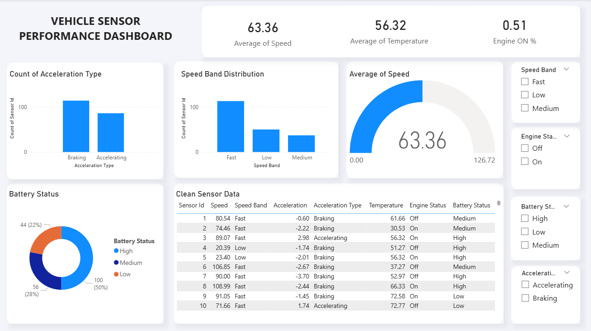
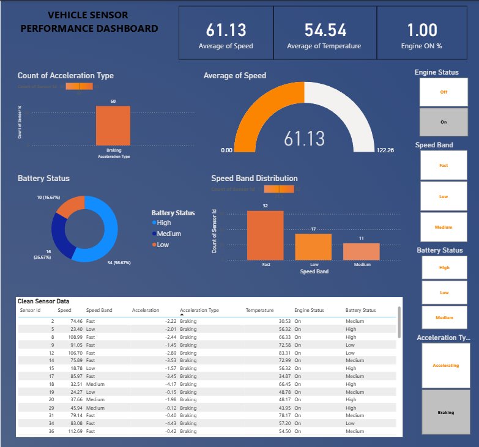

# Vehicle Sensor Performance Analysis | Excel + Power BI

## Project Overview
This project analyzes **vehicle sensor telemetry data** to understand driving behavior, vehicle performance, and system health indicators.  
The workflow begins with **data preparation in Excel** and progresses to **interactive dashboard development in Power BI**.

The goal of the project is to transform raw vehicle sensor data into meaningful visual insights using modern data analytics tools.

---

## Project Workflow

1. **Raw Dataset**
   - Initial vehicle sensor dataset containing speed, acceleration, engine status, temperature, and battery condition.

2. **Data Processing (Excel)**
   - Data cleaning
   - Handling inconsistencies
   - Structuring the dataset for analysis

3. **Power BI Dashboard Development**
   - Initial dashboard version
   - Improved dashboard with enhanced layout and visual design

---

## Tools Used

- **Microsoft Excel**
  - Data cleaning
  - Data preparation
  - Dataset structuring

- **Microsoft Power BI**
  - Data visualization
  - Dashboard creation
  - Interactive data exploration

- **PowerPoint**
  - Dashboard layout design and visual enhancement

---

## Dataset Features

The dataset contains vehicle sensor readings with the following attributes:

- Sensor ID  
- Speed  
- Speed Band (Fast / Medium / Low)  
- Acceleration Value  
- Acceleration Type (Braking / Accelerating)  
- Temperature  
- Engine Status (On / Off)  
- Battery Status (High / Medium / Low)

---

## Dashboard Insights

The dashboards provide insights into:

- Overall vehicle **speed performance**
- **Driving behavior patterns** through acceleration analysis
- Distribution of **speed bands**
- Monitoring of **battery health**
- **Engine status activity**
- Detailed sensor-level data exploration

Interactive filters allow users to explore the dataset dynamically.

---

## Dashboard Preview

Below are screenshots of the Power BI dashboards created in this project.

### Dashboard Version 1 – Initial Dashboard

This version focuses on basic KPI indicators and sensor data visualization.

Initial Power BI dashboard focusing on:

- KPI indicators
- Speed distribution
- Acceleration analysis
- Battery health monitoring

### Dashboard Version 2 (Improved Design)

This version improves the dashboard layout, styling, and visual structure to create clearer data storytelling.

Enhanced version with:

- Improved layout
- Better visual styling
- Structured dashboard design
- PowerPoint-assisted formatting

---

##  Key Insights

- Most vehicles operate within the **Fast speed band**.
- **Braking events occur more frequently** than acceleration events.
- A large proportion of vehicles maintain **high battery health**.
- Engine status varies depending on driving conditions.

---

## Key Learning Outcomes

Through this project I practiced:

- Data cleaning and preparation
- Structuring datasets for analysis
- Building interactive dashboards
- Designing analytical visualizations
- Communicating insights through data

---

## Future Improvements

- Time-series analysis of sensor behavior
- Predictive modeling for vehicle performance
- Integration with real-time IoT sensor data

---

